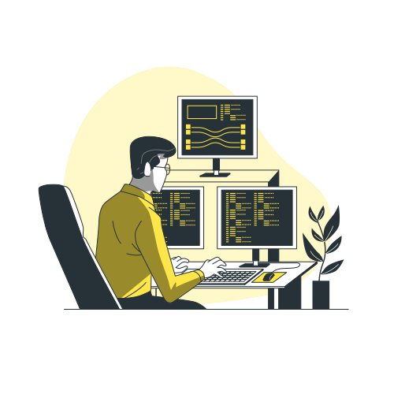

# Hi there I'm [Kacper](https://filipowski.ovh) 👋

  
  

### 🧐 About Me:
- 💻 I'm a 15 year old **front-end developer** from Poland 🇵🇱.
- 🔭 I'm currently working on **Formul.ai and todo-app**.
- 🌱 I'm currently learning **React.js, docker and vim**.
- ⌚ In my free time, I like to **read books📕, listen to music🎶 and lift weights🏋️‍♂️**.
- 🗨️ Always open for *collaboration* or discussions on **web development**.
- 📩 Reach me on Discord: `veresek`.

### 🔨 Languages and Tools:

  

 

## 📈 GitHub Stats 

  
  

